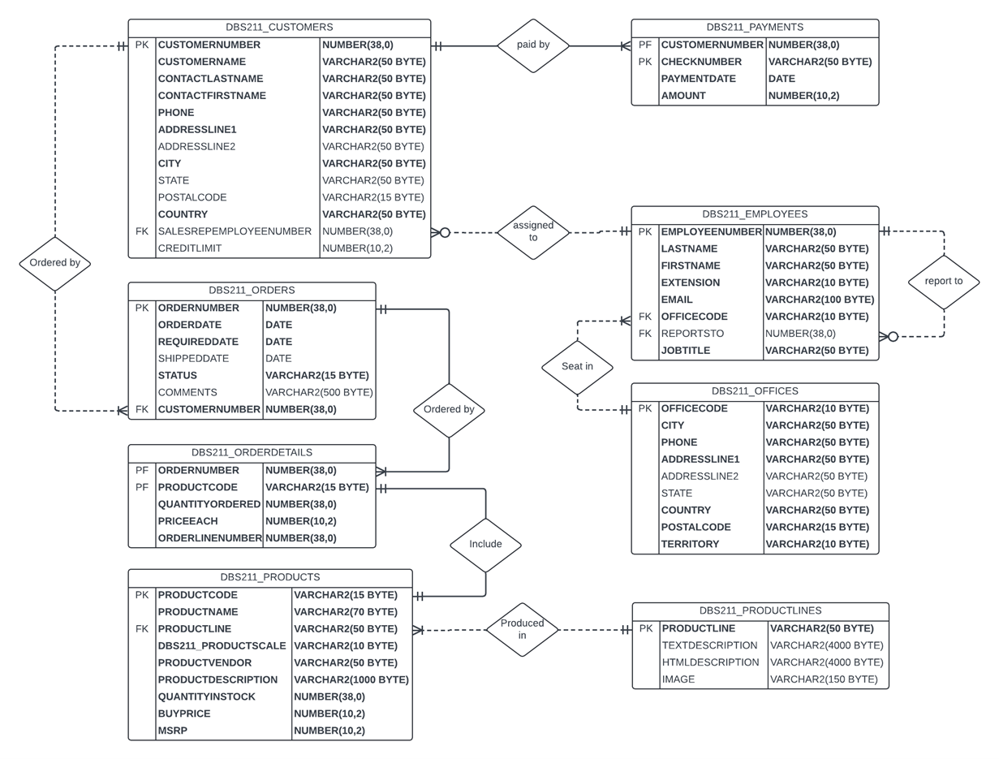

# **Employee Management System**

## **Project Overview**
This project is an **Employee Management System** developed using **Oracle SQL and C++**. It assists companies in managing employee data efficiently, allowing users to view, add, update, and delete employee records through a console interface. Additionally, the system handles database connections using **OCCI (Oracle C++ Call Interface)**, ensuring smooth interaction with the relational database.

The system design follows standard database modeling principles with normalized tables and clear relationships between entities such as employees, offices, and managers. An **Entity-Relationship (ER) diagram** is used to model these relationships, which ensures referential integrity across the system.

---

## **Features**
- **Employee Management**:  
  - Add, edit, search, and delete employee records.
- **Report Generation**:  
  - View a detailed employee report, including manager relationships and office details.
- **Database Integration**:  
  - Connects to an **Oracle database using OCCI** for seamless data management.
- **Input Validation**:  
  - Prevents duplicate employee entries and validates user inputs.
- **SQL Error Handling**: 
  - Handles **SQL** errors gracefully and ensures a stable runtime.
- **SQL Error Handling**:
  - Supports SQL scripts to initialize, reset, and populate the database for quick setup.

### **SQL and C++ Integration**
- **OCCI Library**: 
  - The **Oracle C++ Call Interface (OCCI)** is used to establish a connection between the C++ application and the Oracle database.
- **Parameterized Queries**:
  - SQL queries use bind variables to prevent SQL injection and improve performance.
- **Transaction Management**:
  - Each operation on employee data is committed to the database to ensure persistence. 
   
---

## **Directory Structure**
```
Employee-Management-System/  
│  
├── src/                           # Source code files  
│   ├── main.cpp                   # Main program entry point
│   ├── utility.cpp  
│   └── utility.h                    
│  
├── sql-scripts/                   # SQL scripts for database setup   
│   └── Employee_Schema_Data.sql   # SQL for creating tables and inserting data  
│  
├── assets/                        # Images or screenshots  
│   └── ER_diagram.png             # Sample UI image
│ 
├── Makefile                       # Build instructions for compilation 
├── README.md                      # Project documentation (this file)
└── .gitignore                     # Ignore unnecessary files 
```
 
---

## **System Requirements**
- **Operating System**: Windows / Linux / macOS
- **Oracle Database**: Access to an Oracle database server
- **OCCI Library**: Oracle C++ Call Interface libraries installed
- **C Compiler**: GCC or any compiler supporting the C++ standard
- **Make Tool** (optional): If using `Makefile` for compilation

---

## **Compilation and Execution**

### **Database Setup**
1. Create Tables and Insert Data:
   - Execute ./sql-scripts/employee_system.sql in Oracle database server.
   
**DATA SOURCE**: http://www.mysqltutorial.org  
Name: MySQL Sample Database classicmodels  
Link: http://www.mysqltutorial.org/mysql-sample-database.aspx  

### **Using Makefile:**
1. Open a terminal in the project’s root directory.
2. Run:
   ```bash
   make
   ```
3. Execute the system:
   ```bash
   make run
   ```
4. Clean:
   ```bash
   make clean
   ```

### **Manual Compilation:**
If not using Makefile, compile manually with:
   ```bash
   gcc src/main.c src/utility.c -o bin/employee_system
   ./bin/employee_system
   ```

### **Entity-Relationship Diagram (ERD)**
The ER diagram for the Employee Management System shows the relationships between the main entities.
1. ER diagram of database:  
   

### **Usage Instructions**
1. After launching the system, the main menu will appear:
   ```
   ********************* HR Menu *********************
   1) Find Employee
   2) Employees Report
   3) Add Employee
   4) Update Employee
   5) Remove Employee
   0) Exit
   Please enter your selection (0-5):
   ```
2. Menu Options:
  - 1) Find an employee by employee number.
  - 2) Display a report of all employees.
  - 3) Add a new employee.
  - 4) Update an employee’s information.
  - 5) Remove an employee by ID.
  - 0) Exit the program.

### **FAQ**
1. What happens if I try to add a duplicate employee?
   - The system will notify you that the employee already exists.
2. How are managers linked to employees?
   - Employee records include a reportsTo field linking them to their manager's employee number.
3. What if the database connection fails?
   - SQL errors will be displayed with error codes to help you troubleshoot.
   
### **Future Plans**
- Add more detailed reporting features (e.g., filtering by office or job title).
- Implement role-based access to the system for better security.
- rovide a web or GUI-based interface for enhanced usability.

### **Sample Output**
   ```
   ********************* HR Menu *********************
   1) Find Employee
   2) Employees Report
   3) Add Employee
   4) Update Employee
   5) Remove Employee
   0) Exit
   Please enter your selection (0-5): 1

   Enter Employee Number: 1002

   -------------- Employee Information -------------
   Employee Number: 1002
   Last Name: Murphy
   First Name: Diane
   Extension: x5800
   Email: dmurphy@classicmodelcars.com
   Office Code: 1
   Manager ID: 0
   Job Title: President
   ```
   
### **Contact**
For questions or suggestions, feel free to contact:  
Email: gwhuang24@gmail.com

### **Conclusion**
Thank you for using the Employee Management System! We hope this system helps you efficiently manage employee data. If you encounter any issues or have suggestions for improvement, please reach out.